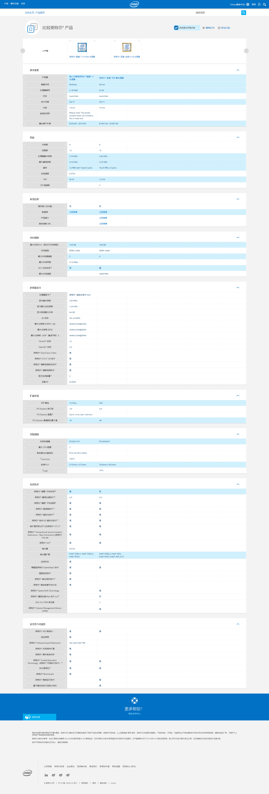
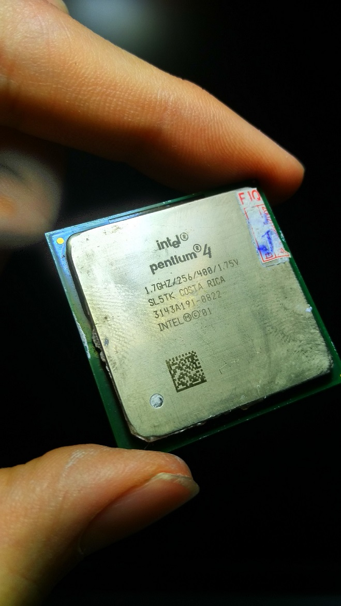
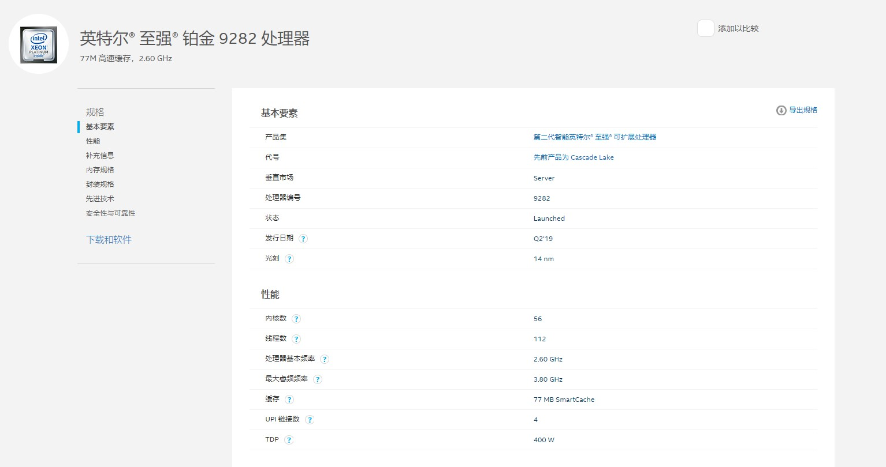
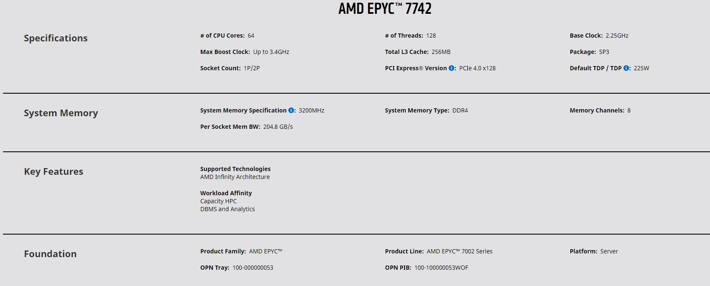

# 关于CPU的一份技术报告

## 前言

CPU是一台服务器或是个人PC上面最重要的组件。相比于消费级的相似规格的CPU，服务器级的CPU的价格通常会翻4~5倍。比如这两块CPU都是英特尔在17年下半年发布的，左边的i7-8700K是消费级CPU，右面的至强金牌6128是服务器级的CPU，两者的核心规格相似，都是6C12T,8700K还自带了核显，频率还高了一点，但价格相差了快五倍。

同时，不同品牌的CPU差价也很大。AMD的处理器就要比英特尔的便宜不少，不论是服务器级还是消费级的都是如此。另外，ARM处理器的PC和服务器最近几年也不断地有新产品出现，PC的产品似乎普遍性价比一般，服务器端的产品在网络上暂时没有搜到公开的评测或是OEM提供的价格，不过ARM的CPU相较于传统的X86的CPU应该能在功耗上面有优势。在设备的续航或者数据中心的省电方面这肯定是一个好消息。

另外，还有一些像SPARC或者POWER架构的CPU，上面跑的是Solaris或是AIX的操作系统，这种机器比上面的那些机器还要贵。不过现在这样的UNIX服务器早已不是主流，免费、开源的Linux再加上X86的CPU占据了现在服务器市场的绝大份额。至于消费级的PC份额也早已被wintel垄断了。

为什么服务器级、消费级的CPU会有如此大的差价，CPU的参数又有哪些呢？接下来会从多个方面来阐述。

## 关键参数

下面列举了CPU的几个参数，并从服务器级/消费级两方面进行了对比。

### 主频

CPU的主频是CPU内核的时钟频率，在同一产品同代架构下面，基本上主频越高就代表着性能越强。不过不同架构的处理器的主频就没有什么可比性了，比如英特尔的NetBurst和AMD的推土机系列，通过增大流水线的级数来提高throughput，提高主频，但最终都陷入了高频低能的怪圈。原因之一可能是流水线一长每次预测错误要插入的bubble就很多。

我的第一台电脑就是用了奔腾4的处理器，主频达到了1.7GHz，核心电压达到了1.75V（现在不超频的话基本是在1.3V以内）。处理器的性能不怎么样，但功耗、温度都比较高。这张照片摄于2018年1月，当时想要折腾一下旧电脑，最后发现风扇出了问题，最后也没有再次点亮它。

服务器级的CPU的主频比消费级产品的主频低，主要原因我觉得是消费级产品比较注重单核性能，而服务器级产品比较注重控制功耗和稳定性。

### TDP

TDP的英文全称是“Thermal Design Power”，中文直译是“散热设计功耗”。主要是提供给计算机系统厂商，散热片/风扇厂商，以及机箱厂商等等进行系统设计时使用的。实际的处理器在满载时的功耗可能会比TDP还要高。相同规格的服务器CPU的TDP通常比消费级CPU要高。这应该是为了让散热器厂商为服务器设计更加强的散热系统。

### 核心规格

服务器的CPU的物理核心数一般比消费级的CPU要多。在2019年第二季度，英特尔发布的这个铂金9282处理器就有56个物理核心。AMD的霄龙EPYC 7742达到了64个核心。

同期的顶级英特尔消费级CPU是i9-10980XE只有18个物理核心。

另外就是处理器对超线程 (Hyper-Threading) 的支持。最初这个超线程的技术只是应用在服务器的CPU上面。不过现在这个技术都下放到低端的奔腾处理器上面去了。这个技术能够在系统并发数比较高的时候提高系统的吞吐量，当然，前提是操作系统必须要支持这项技术。

消费级CPU的核心数比较少的原因一是消费级的用户用不到那么多的核心，消费级的应用软件（除了那些渲染、科学计算之类的软件）也不会对更多的核心进行针对性的优化；二是为了降低功耗，毕竟不是每个消费级的用户都会去配备大功率的电源和非常专业的散热设备；三是为了提高芯片的良品率。

### 最大内存通道数、最大内存大小、ECC内存支持

一开始我们对比了核心规格相似的8700K和至强金牌6128两块处理器。我们可以发现8700K支持的最大内存规格是双通道一共128GB的内存，至强金牌6128则是六通道768GB的内存。同时，前者不支持ECC内存（全称Error Checking and Correcting, 用于校验可能的内存错误）而后者支持。

在对内存的支持方面，服务器级的CPU还是具有很大优势。

### 指令集扩展

一般来说，服务器级的CPU会支持类似于AVX-512这样的向量化指令集，可以在一个指令内完成很多次浮点数的计算。消费级CPU一般只支持到AVX2这种级别。具体还可以看上面的8700K和至强金牌6128两块处理器的对比。

当然，要想让这个指令集发挥作用的话需要人来写支持AVX-512指令集的编译器，然后写代码的人也要把代码写得“向量化”一点。

### 三级缓存

这个参数对于处理器的性能影响还是很大的，更大的缓存意味着处理器有更高的缓存命中率。前两级缓存都是per-core的，而第三级缓存是全部核心共享的，一般来说核心数越多，配置的三缓就越大。服务器CPU配置的三级缓存会比消费级的CPU要大。

## CPU的供应商

现在CPU的供应基本被AMD和Intel两家公司垄断了。其他的像ARM或者POWER这样的非x86的处理器在服务器或是个人PC领域都应用的很少了。

AMD在2017年推出了Ryzen锐龙系列的处理器，比之前的推土机系列不知道高到哪里去了，在CPU的市场中逐渐追回了一点市场份额。

可以在AMD和Intel之间做一个简单的对比。

AMD的优势：

 * 便宜
 * 喜欢折腾个人PC的话可以自己超频，大多数AMD的处理器都是支持超频的
 * 散热表现普遍比较好，原因是CPU的DIE和上层的金属盖的散热材料的导热性比较好

Intel的优势：

 * 产品线丰富，合作厂商多
 * 个人PC的话游戏性能相对更好
 * 在业界拥有一些技术的主导权，比如Thunderbolt协议

不过，在服务器领域，一些很有钱的甲方都不会选择x86阵营的东西，而是直接选IBM的小型机甚至是大型机，再配个Oracle的数据库。现在的许多银行应该都是采用了这样的解决方案。互联网公司用这个的就比较少了，毕竟没什么钱。

## 最后 - Tradeoff

CPU主要的Tradeoff我认为有功耗和性能的Tradeoff，价格和质量的Tradeoff等等。比如在一些轻薄笔记本上，前者的Tradeoff更为突出。而在服务器的市场上，后者的Tradeoff则相对更加重要。考虑到现在如果买服务器通常是买一个整机或者说是一个包含售后的“解决方案”而不是自己组装服务器，CPU在这个决策之中的比重其实已经不是很大了。

## 参考资料

1. https://ark.intel.com Intel Product Specifications
2. https://www.amd.com/zh-hans/products/epyc-server AMD EPYC（霄龙）服务器处理器
3. 自己拍的奔腾4的照片
