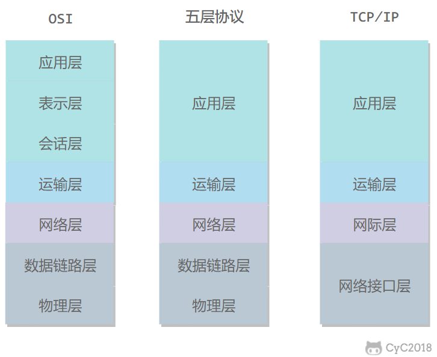
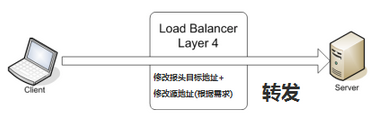
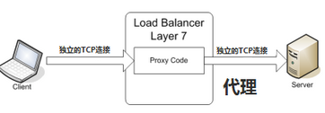
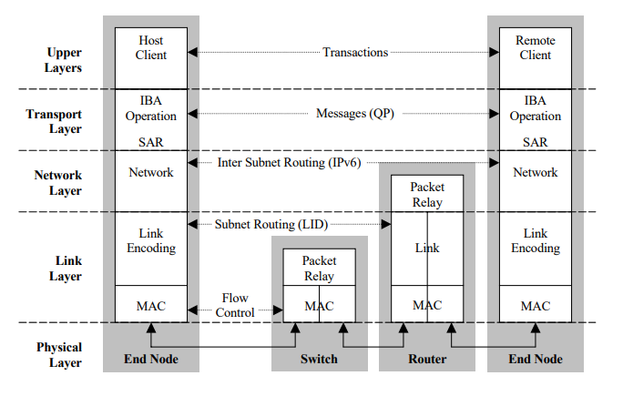
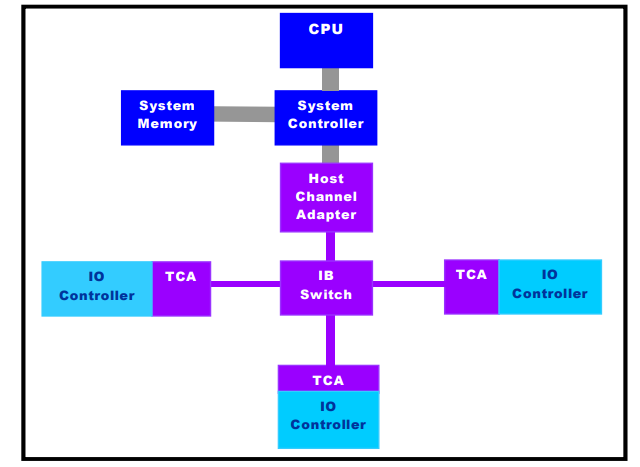
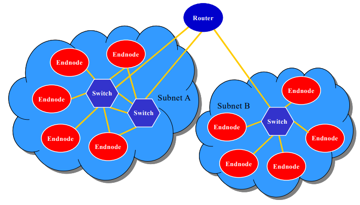

# Network

## Basic Intro

### 计算机网络体系结构

### 五层协议

- **应用层** ：为特定应用程序提供数据传输服务，例如 HTTP、DNS 等协议。数据单位为报文。
- **传输层** ：为进程提供通用数据传输服务。由于应用层协议很多，定义通用的传输层协议就可以支持不断增多的应用层协议。运输层包括两种协议：传输控制协议 TCP，提供面向连接、可靠的数据传输服务，数据单位为报文段；用户数据报协议 UDP，提供无连接、尽最大努力的数据传输服务，数据单位为用户数据报。TCP 主要提供完整性服务，UDP 主要提供及时性服务。
- **网络层** ：为主机提供数据传输服务。而传输层协议是为主机中的进程提供数据传输服务。网络层把传输层传递下来的报文段或者用户数据报封装成分组。
- **数据链路层** ：网络层针对的还是主机之间的数据传输服务，而主机之间可以有很多链路，链路层协议就是为同一链路的主机提供数据传输服务。数据链路层把网络层传下来的分组封装成帧。
- **物理层** ：考虑的是怎样在传输媒体上传输数据比特流，而不是指具体的传输媒体。物理层的作用是尽可能屏蔽传输媒体和通信手段的差异，使数据链路层感觉不到这些差异。

### OSI

其中表示层和会话层用途如下：

- **表示层** ：数据压缩、加密以及数据描述，这使得应用程序不必关心在各台主机中数据内部格式不同的问题。
- **会话层** ：建立及管理会话。

五层协议没有表示层和会话层，而是将这些功能留给应用程序开发者处理。

### TCP/IP

它只有四层，相当于五层协议中数据链路层和物理层合并为网络接口层。

TCP/IP 体系结构不严格遵循 OSI 分层概念，应用层可能会直接使用 IP 层或者网络接口层。

### 数据在各层之间的传递过程

在向下的过程中，需要添加下层协议所需要的首部或者尾部，而在向上的过程中不断拆开首部和尾部。

路由器只有下面三层协议，因为路由器位于网络核心中，不需要为进程或者应用程序提供服务，因此也就不需要传输层和应用层。

## Load Balancing（Network）

### 简介

**负载均衡** 就是基于现有的网络结构，提供了一种廉价有效透明的方法扩展网络设备和服务器的带宽、增加吞吐量、加强网络数据处理能力、提高网络的灵活性和可用性。能做负载均衡的对象有很多，我们这里针对 **OSI网络层次** 。

**根据负载均衡所作用在 OSI 模型的位置不同，负载均衡可以大概分为以下几类：**

- **二层负载均衡（mac）**

  根据OSI模型分的二层负载，一般是用虚拟mac地址方式，外部对虚拟MAC地址请求，负载均衡接收后分配后端实际的MAC地址响应。

- **三层负载均衡（ip）**

  一般采用虚拟IP地址方式，外部对虚拟的ip地址请求，负载均衡接收后分配后端实际的IP地址响应。

- **四层负载均衡（tcp）**

  在三层负载均衡的基础上，用ip+port接收请求，再转发到对应的机器。

- **七层负载均衡（http）**

  根据虚拟的url或IP，主机名接收请求，再转向相应的处理服务器。

在实际应用中，比较常见的就是四层负载及七层负载。这里也重点说下这两种负载。

### 四层负载均衡（基于IP+端口的负载均衡）

所谓四层负载均衡，也就是主要通过报文中的目标地址和端口，再加上负载均衡设备设置的服务器选择方式，决定最终选择的内部服务器。

四层负载均衡具体实现方式为：通过报文中的IP地址和端口，再加上负载均衡设备所采用的负载均衡算法，最终确定选择后端哪台下游服务器。以TCP为例，客户端向负载均衡发送SYN请求建立第一次连接，通过配置的负载均衡算法选择一台后端服务器，并且将报文中的IP地址信息修改为后台服务器的IP地址信息，因此**TCP三次握手连接是与后端服务器直接建立起来的。**

​																				  tcp

​									A——————>Proxy——————>B

实现四层负载均衡的软件有：

- F5：硬件负载均衡器，功能很好，但是成本很高。

- lvs：重量级的四层负载软件

- nginx：轻量级的四层负载软件，带缓存功能，正则表达式较灵活

- haproxy：模拟四层转发，较灵活

  

### 七层的负载均衡（基于虚拟的URL或主机IP的负载均衡)

所谓七层负载均衡，也就是主要通过报文中的真正有意义的应用层内容，再加上负载均衡设备设置的服务器选择方式，决定最终选择的内部服务器。一般是基于请求URL地址的方式进行代理转发。

七层服务均衡在应用层选择服务器，只能先与负载均衡设备进行TCP连接，**然后负载均衡设备再与后端服务器建立另外一条TCP连接通道**。负载均衡设备在这种情况下，更类似于一个**代理服务器**。因此，七层负载均衡明显的对负载均衡设备的要求更高，处理七层的能力也必然会低于四层模式的部署方式。

​													tcp								tcp

​										A——————>Proxy——————>B

实现七层负载均衡的软件有：

- haproxy：天生负载均衡技能，全面支持七层代理，会话保持，标记，路径转移；
- nginx：只在http协议和mail协议上功能比较好，性能与haproxy差不多；
- apache：功能较差
- Mysql proxy：功能尚可。

### 对比

|          | layer4                  | layer7                                           |
| -------- | ----------------------- | ------------------------------------------------ |
| 基于     | IP+Port                 | 虚拟的URL或主机IP等                              |
| 类似于   | 路由器                  | 代理服务器                                       |
| 握手次数 | 1 次                    | 2 次                                             |
| 复杂度   | 低                      | 高                                               |
| 性能     | 高；无需解析内容        | 中；需要算法识别 URL，Cookie 和 HTTP head 等信息 |
| 安全性   | 低，无法识别 DDoS等攻击 | 高， 可以防御SYN cookie以SYN flood等             |
| 额外功能 | 无                      | 会话保持，图片压缩，防盗链等                     |

## Advanced Network Techs

### InfiniBand

**InfiniBand**（直译为“无限带宽”技术，缩写为**IB**）是一个用于高性能计算的计算机网络通信标准，它具有极高的吞吐量和极低的延迟，用于计算机与计算机之间的数据互连。InfiniBand也用作服务器与存储系统之间的直接或交换互连，以及存储系统之间的互连。

#### InfiniBand Layers

InfiniBand体系结构分为多个层，其中每一层彼此独立运行。 如图5所示，“ InfiniBand层” InfiniBand分为以下几层：物理层，链路层，网络层，传输层和上层。

#### InfiniBand Elements

InfiniBand体系结构定义了用于系统通信的多个设备：通道适配器，交换机，路由器和子网管理器。 在子网内，每个端节点必须至少有一个通道适配器和一个子网管理器来建立和维护链接。 所有通道适配器和交换机都必须包含处理与子网管理器通信所需的子网管理代理（SMA）。

##### **通道适配器**

​		通道适配器将InfiniBand连接到其他设备。 通道适配器有两种类型，主机通道适配器（HCA）和目标通道适配器（TCA）。HCA提供到主机设备的接口，并支持InfiniBand定义的所有软件Verb。 动词是一种抽象表示形式，它定义了客户端软件和HCA功能之间所需的接口。 动词不为操作系统指定应用程序编程接口（API），而是为OS供应商定义用于开发可用API的操作。
​		TCA提供了从InfiniBand到I / O设备的连接，以及每个设备特定操作所需的一部分HCA功能。

##### **交换机**

交换机是InfiniBand结构的基本组件。 交换机包含多个InfiniBand端口，并根据第二层本地路由头中包含的LID将数据包从其端口之一转发到另一个端口。 除管理数据包外，交换机不会使用或生成数据包。 像通道适配器一样，要求交换机实现SMA以响应子网管理数据包。 交换机可以配置为转发单播数据包（到单个位置）或多播数据包（寻址到多个设备）。

##### **路由器**

  InfiniBand路由器将数据包从一个子网转发到另一个子网，而不会使用或生成数据包。 与交换机不同，路由器根据其IPv6网络层地址读取全局路由报头以转发数据包。 路由器在下一个子网中使用正确的LID重建每个数据包。

##### **子网管理器**

子网管理器配置本地子网并确保其继续运行。 子网中至少应存在一个子网管理器，以管理所有交换机和路由器的设置，并在链路断开或出现新链路时对子网进行重新配置。 子网管理器可以位于子网上的任何设备中。 子网管理器通过每个专用SMA（每个InfiniBand组件需要）与子网中的设备通信。