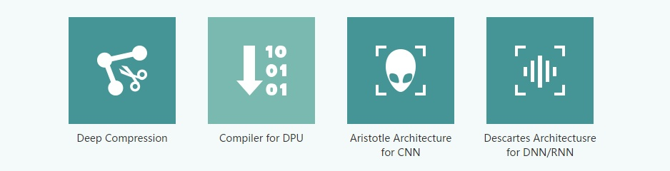

xPU(xxx Processing Unit): functional processing unit for certain usage
=======================

## Introduction

With the development of AI chips, variant xPUs comes out with such a name to be impressive to people.
xPU is a certain processor for certain usage in fact.

## A 

1. **Accelerated Processing Units**: 

	Craft from AMD, integrating CPU and GPU on single chip,
	which supports flexibly scheduling between CPU and GPU on motherboard without dependency of northbridge.

 

2. **Audio Processing Unit**: 

	Aimed for audio signal processing.
	Very common in sound cards.

## B

1. **Brain Processing Unit**:

	Craft from Horizon Robotics, coming from a Beijing company found in 2005.
	Aimed for IoT rather than robot, meaning brains of artifact intelligence.

 

2. **Biological Processing Unit**:

	Microprocessor consists of biological parts of I/O device, control unit, etc,
	which works as simulating living things.

	> **Biological process** are the processes vital for a living organism to live, 
	> and that shape its capacities for interacting with its environment. 
	> Biological processes are made up of many chemical reactions or other events 
	> that are involved in the persistence and transformation of life forms.

 

3. **Bio-Recognition Processing Unit**:

	Except for specific ASIC chips, the most common bio-recognition is basically working on
	the combination of CPU and DPU.

	> A **biosensor** is an analytical device, used for the detection of a chemical substance, 
	> that combines a biological component with a physicochemical detector.

## D

1. **Deep-Learning Processing Unit**:

	DPU is not a propriety term for a certain company.
	There are many companies working on DPU,
	such as:

	- Deephi Tech:
	A company located in Beijing. Their neural network processor based on FPGA is named as DPU.
	They have developed two DPUs till now, Aristotle architecture for CNN and Cartesian architecture for DNN/RNN.

	

	
	

	- TensTorrent: 
	A company located in Toronto, working on high-performance processor for deep-learning and intelligent hardware.
	Technical staff comes from NVDIA and AMD.

2. **Deep Learning Unit**:

	Registered by Fujitsu for their own AI chips.
	DLU consists of many small DPUs and several larger master cores(controlling access to DPUs and memory).
	Each DPU includes 16 DPE(Deep-Learning Processing Element)s, so that there are totally 128 elements working for SIMD instructions.

 

3. **Dataflow Processing Unit**:

	The deep learing accelerator developed by [Wave Computing](https://wavecomp.ai/) is named as **Dataflow Processing Unit**.
	DPU is integrated with 1024 clusters, with each cluster related to single fully customized layout.
	Each cluster consists of 8 arithmetic elements and 16 PEs,
	in which PEs are implemented asynchronously driven by data flow rather than clock signal,
	for which being named as **Dataflow Processor**.

	> With craft of TSMC 16nm FinFET, DPU die square of 400mm^2, internal single port of at least 24MB,
	> power consumption of about 200W, equivalent frequency up to 10 GHz and peformance up to 181TOPs.

 

4. **Data-storage Processing Unit**:

	Master chip for SSD developed by [DapuStor](http://www.dputech.com/) in Shenzhen.

5. **Digital Signal Processor**:

	DSPs are designed by TI, Qualcomm, CEVA, Tensilica, ADI, Freescale, etc.
	Contrasted with CPU, DSP improves its digital computing peformance by increasing parallelism,
	like SIMD, VLIW, SuperScalar.

## E

1. **Emotion Processing Unit**:
	
	The first emotion synthesis engine providing robots with emotions was developed by [Emoshape](https://emoshape.com/).
	**EPU** is based on **MCU**, combined with **API** and cloud native enhanced learning algorithm,
	which helps machines understand what they're watching and reading in terms of emotions.
	With **NLG** and **WaveNet**, machines can express their emotions.

 

## F

1. **Floating Point Unit**:

	Commonly integrated in modern high-performance CPU, DSP and GPU.

## G

1. **Graphics Processing Unit**:

	

	
	

	 

	A graphics processing unit (GPU) is a specialized electronic circuit designed to rapidly manipulate and alter memory to accelerate the creation of images in a frame buffer intended for output to a display device. 
	GPUs are used in embedded systems, mobile phones, personal computers, workstations, and game consoles. 
	Modern GPUs are very efficient at manipulating computer graphics and image processing. 
	Their highly parallel structure makes them more efficient than general-purpose central processing units (CPUs) for algorithms that process large blocks of data in parallel. 
	In a personal computer, a GPU can be present on a video card or embedded on the motherboard. 
	In certain CPUs, they are embedded on the CPU die.

	The term "GPU" was coined by Sony in reference to the PlayStation console's Toshiba-designed Sony GPU in 1994.
	The term was popularized by Nvidia in 1999, who marketed the GeForce 256 as "the world's first GPU".
	It was presented as a "single-chip processor with integrated transform, lighting, triangle setup/clipping, and rendering engines".
	Rival ATI Technologies coined the term "visual processing unit" or VPU with the release of the Radeon 9700 in 2002.

	- NVIDIA

	- AMD

	- Mali from ARM

	- PowerVR from Imagination

	- Adreno from Qualcomm

	- Vivante from VeriSilicon

	- Apple

2. **Graph Streaming Processor**:

	

	Proposed by [ThinCI(think-eye)](https://www.thinci.com/).
	Aimed for the application on auto-driving.
	Using a variety of structural techniques to achieve paralleling at the level of
	task, thread, data and instruction.
	With craft of TSMC 28nm HPC+, power consumption about 2.5W.

## H

1. **Holographic Processing Unit**:

	

	Developed by **Microsoft** for its own applications of Hololens.
	The first generation uses the craft of 29nm HPC and customized extension with 24 Tensilica DSP.
	The HPU supports 5-way cameras, a 1-way depth sensor (Depth sensor) and a 1-way motion sensor (Motion Sensor).

## I

1. **Intelligence Processing Unit**:
	
	There are two companies declaring the name IPU:

	- [Graphcore](https://www.graphcore.ai/)

	

	The IPU from Graphcore is aimed for graph computing.
	Graphcore believes that Graph is a very natural representation of knowledge models and corresponding algorithms, 
	so Graph is the basic representation of machine intelligence, applicable to both neural networks, 
	Bayesian networks and Markov fields, and possible future new models and algorithms.

	- [Mythic](https://www.mythic-ai.com/)

	> Mythic's intelligence processing unit (IPU) adds best-in-class intelligence to any device.

	Mythic claims to reduce power consumption to 1/50. The reason why they are so confident is because they use the "processing in memory" structure.

	

	At each clock cycle, the pipelined ALU can either load data from memory or store data to memory, but not both
	at the same time. Also, on each clock cycle, the MU produces three outputs that can be either selected for storage
	(under mask control) or selected for recirculation.
	Additionally, data can be sent to other processors via the routing network.
	The processor can input data through a multiplexer
	(MUX) from either the parallel prefix network, the global
	OR network, the partitioned OR network, or the internal
	mask/register control.

2. **Image Processing Unit**:
	
	

	
	

	 

	Some static image processing modules of SOC chips are called IPUs,
	also ISPs(Image Signal Processor),
	which are used to process the output signals of camera devices
	such as cameras, and implements functions such as noise reduction, demosaicing, HDR, and color management.

## K

1. **Knowledge Processing Unit**:

	Declared by [Canaan](https://canaan.io/) for its AI chip in 2017,
	which integrating artificial neural network and high performance processor in single chip
	to provide heterogeneous, real-time, offline artificial intelligence application services.

## M

1. **Micro Processing Unit**:

	

	A microprocessor (µP) or a Microprocessing Unit (MPU) is a device that implements the core elements of a computer system on a single integrated circuit, or as a few integrated circuits operating as a cohesive unit, designed for the processing digital data.

	Modern microprocessors typically incorporate the functionality of a clock, central processing unit (CPU), arithmetic logic unit (ALU), floating point unit (FPU), control unit (CU), memory management unit (MMU), interrupts, input/output interfaces, and cache. Specialized microprocessor may also serve as graphical processing units (GPUs), signal processing units (DSPs), neural processing unit (NPUs), microcontrollers, etc.

2. **Mind Processing Unit**:
	
	An eternal tale.

3. **Memory Protection Unit**:

	

	The Memory Protection Unit (MPU) is a programmable unit that allows privileged software, typically an
	OS kernel, to define memory access permission. It monitors transactions, including instruction fetches
	and data accesses from the processor, which can trigger a fault exception when an access violation is
	detected.

## N

1. **Neural-Network Processing Unit**:

	

	Due to the difference between the types and calculations of neural network calculations 
	and traditional calculations, traditional CPUs, DSPs, and even GPUs have deficiencies in computing power, 
	performance, and energy efficiency when performing NN calculations the requirements of the NPU is activated.

	- [Vimicro](http://www.vimicro.com.cn/)

	- [Kneron](http://www.kneron.com/)

	- [Verisilicon](http://www.verisilicon.com)

	- [nationalchip](http://www.nationalchip.com)

2. **Neural/Neuromorphic Processing Unit**:

	

	
	

	 

	A neural processing unit (NPU) is a well-partitioned circuit that comprises of all the control
	and arithmetic logic components necessary to execute machine learning algorithms.
	NPUs are designed to accelerate the performance of common machine learning tasks such as image classification,
	machine translation, object detection, and various other predictive models.
	NPUs may be part of a large SoC, a plurality of NPUs may be instantiated on a single chip,
	or they may be part of a dedicated neural-network accelerator.

	- Zeroth from Qualcomm

	- TrueNorth from IBM

	- Loihi from Intel

	- SNAP from BrainChip

	- CM1K, NM500, NeuroMem IP from GeneralVision

	- Knowm

	- Koniku

	- westwell

3. **Network Processing Unit**:
	
	

	A network processor is an integrated circuit which has a feature set specifically targeted at the networking application domain.
	Network processors are typically software programmable devices and would have generic characteristics similar to general purpose central processing units that are commonly used in many different types of equipment and products.

## O

1. **Optical-Flow Processing Unit**:
	
	

	Optical flow or optic flow is the pattern of apparent motion of objects, surfaces, and edges in a visual scene caused by the relative motion between an observer and a scene.
	Optical flow can also be defined as the distribution of apparent velocities of movement of brightness pattern in an image.
	OPU can be needed in acceleration with ASIC IP.

## P

1. **Physical Processing Unit**:

	

	A physics processing unit (PPU) is a dedicated microprocessor designed to handle the calculations of physics, especially in the physics engine of video games. It is an example of hardware acceleration.
	Examples of calculations involving a PPU might include rigid body dynamics, soft body dynamics, collision detection, fluid dynamics, hair and clothing simulation, finite element analysis, and fracturing of objects.
	The idea is that specialized processors offload time consuming tasks from a computer's CPU, much like how a GPU performs graphics operations in the main CPU's place. The term was coined by [Ageia](http://www.ageia.com/) to describe its PhysX chip. Several other technologies in the CPU-GPU spectrum have some features in common with it, although Ageia's product was the only complete one designed, marketed, supported, and placed within a system exclusively as a PPU.

## Q

1. **Quantum Processing Unit**:

	

	Quantum computing is the study of a still-hypothetical model of computation. Whereas traditional models of computing such as the Turing machine or Lambda calculus rely on "classical" representations of computational memory, a quantum computation could transform the memory into a quantum superposition of possible classical states. A quantum computer is a device that could perform such computation.
	A quantum processing unit (QPU), also referred to as a quantum chip, is a physical (fabricated) chip that contains a number of interconnected qubits. It is the foundational component of a full quantum computer, which includes the housing environment for the QPU, the control electronics, and many other components.

## R

1. **Resistive Processing Unit**:

	

	This is the concept put forward by researchers at the IBM Watson Research Center. It is really a processing unit, not a processor. RPU can implement both storage and calculation. With RPU arrays, IBM researchers can achieve 80TOPS/s/W performance.

2. **Ray-tracing Processing Unit**:

	Ray tracing is a rendering algorithm in computer graphics. RPU is an accelerator developed to accelerate the calculation of data in it. Now these calculations are all GPU things.

## S

1. **Streaming Processing Unit**:
	
	Stream processing is a computer programming paradigm, equivalent to dataflow programming, event stream processing, and reactive programming,
	that allows some applications to more easily exploit a limited form of parallel processing. Such applications can use multiple computational units, such as the floating point unit on a graphics processing unit or field-programmable gate arrays (FPGAs),
	without explicitly managing allocation, synchronization, or communication among those units.
	The SPU first appeared in the structure of the graphics chip. It can be said that the GPU is a stream processor. Even, there was a company named "Streaming Processor Inc", which was founded in 2004. In 2009, SPI was closed as the founder and chairman was dug up to NVIDIA as the chief scientist.

2. **Speech-Recongnition Processing Unit**:

	Speech recognition is a interdisciplinary subfield of computational linguistics that develops methodologies and technologies that enables the recognition and translation of spoken language into text by computers. It is also known as automatic speech recognition (ASR), computer speech recognition or speech to text (STT). It incorporates knowledge and research in the linguistics, computer science, and electrical engineering fields.

## T

1. **Tensor Processing Unit**:

	

	Many architects believe that major improvements in cost-energy-performance must now come from domain-specific hardware. This paper evaluates a custom ASIC—called a Tensor Processing Unit (TPU)—deployed in datacenters since 2015 that accelerates the inference phase of neural networks (NN). The heart of the TPU is a 65,536 8-bit MAC matrix multiply unit that offers a peak throughput of 92 TeraOps/second (TOPS) and a large (28 MiB) software-managed on-chip memory. The TPU’s deterministic execution model is a better match to the 99th-percentile response-time requirement of our NN applications than are the time-varying optimizations of CPUs and GPUs (caches, out-of-order execution, multithreading, multiprocessing, prefetching, …) that help average throughput more than guaranteed latency. The lack of such features helps explain why, despite having myriad MACs and a big memory, the TPU is relatively small and low power. We compare the TPU to a server-class Intel Haswell CPU and an Nvidia K80 GPU, which are contemporaries deployed in the same datacenters. Our workload, written in the high-level TensorFlow framework, uses production NN applications (MLPs, CNNs, and LSTMs) that represent 95% of our datacenters’ NN inference demand. Despite low utilization for some applications, the TPU is on average about 15X - 30X faster than its contemporary GPU or CPU, with TOPS/Watt about 30X - 80X higher. Moreover, using the GPU’s GDDR5 memory in the TPU would triple achieved TOPS and raise TOPS/Watt to nearly 70X the GPU and 200X the CPU. 

## V

1. **Vision Processing Unit**:

	

	A vision processing unit (VPU) is a type of microprocessor aimed at accelerating machine learning and artificial intelligence technologies. It is a specialized processor that is made to support tasks like image processing, one of several specialized chips such as the GPU that are generally useful in machine learning.
	The vision processing unit is in some ways similar to a video processing unit which is used with convolutional neural networks. Where a video processing unit is a specific type of graphics processing, the vision processing unit is described as more suitable for running different types of machine vision algorithms – these tools may be built with specific resources for getting visual data from cameras – they are built for parallel processing. Like video processing units, they are particularly geared toward image processing. Some of these tools are described as “low power and high performance” and may be plugged into interfaces that allow for programmable use. Other aspects of the build can vary due to manufacturer and design choices.

2. **Vector Processing Unit**:

	

	In computing, a vector processor or array processor is a central processing unit (CPU) that implements an instruction set containing instructions that operate on one-dimensional arrays of data called vectors, compared to the scalar processors, whose instructions operate on single data items. Vector processors can greatly improve performance on certain workloads, notably numerical simulation and similar tasks. Vector machines appeared in the early 1970s and dominated supercomputer design through the 1970s into the 1990s, notably the various Cray platforms. The rapid fall in the price-to-performance ratio of conventional microprocessor designs led to the vector supercomputer's demise in the later 1990s.

## W

1. **Wearable Processing Unit**:

	

	In 2014, an Indian company, Ineda Systems, advertised their WPU concept for the IOT market and received funding from Qualcomm and Samsung. The "Dhanush WPU" developed by Ineda Systems is divided into four levels to accommodate the computing needs of wearable devices from the average to the high-end, allowing the wearable device's battery to last up to 30 days of continuous battery life. Consumption. However, everything seems to have come to an abrupt end in 2015 and there is no news. Only at the bottom of the homepage has text display, Ineda applied for a registered trademark by WPU. The information about the WPU is only approximate, oh, yes, there is a US patent.

## X

X means everything

## Z

1. **Zylin CPU**: 
	
	CPU of Zylin, a Norwegian company. 
	[Reference Github page zylin/zpu](https://github.com/zylin/zpu).
	The worlds smallest 32 bit CPU with GCC toolchain,
	which means 'Taking up very little resources and the architecture itself is small.'

## Reference

1. [Wikipedia](https://en.wikipedia.org/wiki/Main_Page)
2. 知乎 [零基础看懂全球AI芯片: 详解"xPU"](https://zhuanlan.zhihu.com/p/28325678)
3. [The biological microprocessor, or how to build a computer with biological parts](https://www.ncbi.nlm.nih.gov/pmc/articles/PMC3962179/)
4. [Emoshape](https://emoshape.com/)
5. [Processing in Memory: The Terasys Massively Parallel PlM Array](https://ieeexplore.ieee.org/stamp/stamp.jsp?tp=&arnumber=375174)
6. [Wikichip](https://en.wikichip.org)
7. [Memory Protection Unit (MPU)](https://static.docs.arm.com/100699/0100/armv8m_architecture_memory_protection_unit_100699_0100_00_en.pdf)
8. [How Network Processors Work](https://barrgroup.com/Embedded-Systems/How-To/Network-Processors)
9. [NVIIDA PhysX](https://www.geforce.com/hardware/technology/physx)
10. [The Quantum Processing Unit (QPU)](http://docs.rigetti.com/en/1.9/qpu.html)
11. [Analog CMOS-based Resistive Processing Unit for Deep Neural Network Training](https://arxiv.org/pdf/1706.06620.pdf)
12. [Resistive Computing: Based on the Human Brain](http://web.mit.edu/writing/gradexam/2016/readings/Resistive_Computing_PC_Magazine.pdf)
13. [Google TPU 揭密](https://mp.weixin.qq.com/s/Kf_L4u7JRxJ8kF3Pi8M5iw)
14. [In-Datacenter Performance Analysis of a Tensor Processing Unit](https://arxiv.org/pdf/1704.04760.pdf)
15. [Vision Processing Unit (VPU)](https://www.techopedia.com/definition/32870/vision-processing-unit-vpu)
