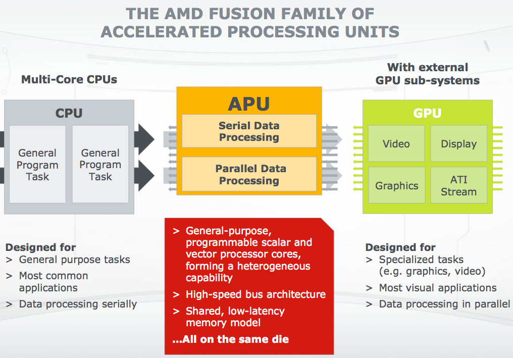
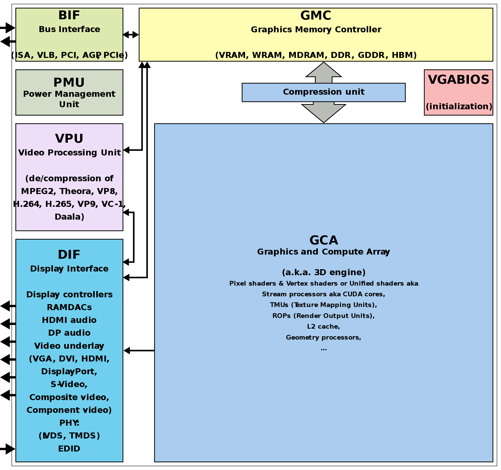

xPU(xxx Processing Unit): functional processing unit for certain usage
=======================

## Introduction

FPGA(Field Programmable Gate Array)

## A 

1. **Accelerated Processing Units**: 

	Craft from AMD, integrating CPU and GPU on single chip,
	which supports flexibly scheduling between CPU and GPU on motherboard without dependency of northbridge.

 

2. **Audio Processing Unit**: 

	Aimed for audio signal processing.
	Very common in sound cards.

## B

1. **Brain Processing Unit**:

	Craft from Horizon Robotics, coming from a Beijing company found in 2005.
	Aimed for IoT rather than robot, meaning brains of artifact intelligence.

 

2. **Biological Processing Unit**:

	Microprocessor consists of biological parts of I/O device, control unit, etc,
	which works as simulating living things.

	> **Biological process** are the processes vital for a living organism to live, 
	> and that shape its capacities for interacting with its environment. 
	> Biological processes are made up of many chemical reactions or other events 
	> that are involved in the persistence and transformation of life forms.

 

3. **Bio-Recognition Processing Unit**:

	Except for specific ASIC chips, the most common bio-recognition is basically working on
	the combination of CPU and DPU.

	> A **biosensor** is an analytical device, used for the detection of a chemical substance, 
	> that combines a biological component with a physicochemical detector.

## D

1. **Deep-Learning Processing Unit**:

	DPU is not a propriety term for a certain company.
	There are many companies working on DPU,
	such as:

	- Deephi Tech:
	A company located in Beijing. Their neural network processor based on FPGA is named as DPU.
	They have developed two DPUs till now, Aristotle architecture for CNN and Cartesian architecture for DNN/RNN.

	

	
	

	- TensTorrent: 
	A company located in Toronto, working on high-performance processor for deep-learning and intelligent hardware.
	Technical staff comes from NVDIA and AMD.

2. **Deep Learning Unit**:

	Registered by Fujitsu for their own AI chips.
	DLU consists of many small DPUs and several larger master cores(controlling access to DPUs and memory).
	Each DPU includes 16 DPE(Deep-Learning Processing Element)s, so that there are totally 128 elements working for SIMD instructions.

 

3. **Dataflow Processing Unit**:

	The deep learing accelerator developed by [Wave Computing](https://wavecomp.ai/) is named as **Dataflow Processing Unit**.
	DPU is integrated with 1024 clusters, with each cluster related to single fully customized layout.
	Each cluster consists of 8 arithmetic elements and 16 PEs,
	in which PEs are implemented asynchronously driven by data flow rather than clock signal,
	for which being named as **Dataflow Processor**.

	> With craft of TSMC 16nm FinFET, DPU die square of 400mm^2, internal single port of at least 24MB,
	> power consumption of about 200W, equivalent frequency up to 10 GHz and peformance up to 181TOPs.

 

4. **Data-storage Processing Unit**:

	Master chip for SSD developed by [DapuStor](http://www.dputech.com/) in Shenzhen.

5. **Digital Signal Processor**:

	DSPs are designed by TI, Qualcomm, CEVA, Tensilica, ADI, Freescale, etc.
	Contrasted with CPU, DSP improves its digital computing peformance by increasing parallelism,
	like SIMD, VLIW, SuperScalar.

## E

1. **Emotion Processing Unit**:
	
	The first emotion synthesis engine providing robots with emotions was developed by [Emoshape](https://emoshape.com/).
	**EPU** is based on **MCU**, combined with **API** and cloud native enhanced learning algorithm,
	which helps machines understand what they're watching and reading in terms of emotions.
	With **NLG** and **WaveNet**, machines can express their emotions.

 

## F

1. **Floating Point Unit**:

	Commonly integrated in modern high-performance CPU, DSP and GPU.

## G

1. **Graphics Processing Unit**:

	

	
	

	 

	A graphics processing unit (GPU) is a specialized electronic circuit designed to rapidly manipulate and alter memory to accelerate the creation of images in a frame buffer intended for output to a display device. 
	GPUs are used in embedded systems, mobile phones, personal computers, workstations, and game consoles. 
	Modern GPUs are very efficient at manipulating computer graphics and image processing. 
	Their highly parallel structure makes them more efficient than general-purpose central processing units (CPUs) for algorithms that process large blocks of data in parallel. 
	In a personal computer, a GPU can be present on a video card or embedded on the motherboard. 
	In certain CPUs, they are embedded on the CPU die.

	The term "GPU" was coined by Sony in reference to the PlayStation console's Toshiba-designed Sony GPU in 1994.
	The term was popularized by Nvidia in 1999, who marketed the GeForce 256 as "the world's first GPU".
	It was presented as a "single-chip processor with integrated transform, lighting, triangle setup/clipping, and rendering engines".
	Rival ATI Technologies coined the term "visual processing unit" or VPU with the release of the Radeon 9700 in 2002.

	- NVIDIA

	- AMD

	- Mali from ARM

	- PowerVR from Imagination

	- Adreno from Qualcomm

	- Vivante from VeriSilicon

	- Apple

Graph Streaming Processor

## H

Holographic Processing Unit

## I

Intelligence Processing Unit

Image Processing Unit

## K

Knowledge Processing Unit

## M

Micro Processing Unit

Mind Processing Unit

Mobile Processing Unit

Motion Processing Unit

## N

Neural-Network Processing Unit

Neural/Neuromorphic Processing Unit

Network Processing Unit

## O

Optical-Flow Processing Unit

## P

Physical Processing Unit

## Q

Quantum Processing Unit

## R

Resistive Processing Unit

Ray-tracing Processing Unit

## S

Streaming Processing Unit

Speech-Recongnition Processing Unit

Smart Processing Unit

Space Processing Unit

## T

Tensor Processing Unit

## U

Universe Processing Unit

## V

Vision Processing Unit

Visual Processing Unit

Video Processing Unit

Vector Processing Unit

## W

Wearable Processing Unit

Wisdom Processing Unit

## X

X means everything

## Z

**Zylin CPU**: 
CPU of Zylin, a Norwegian company. 
[Reference Github page zylin/zpu](https://github.com/zylin/zpu).
> The worlds smallest 32 bit CPU with GCC toolchain,
> which means 'Taking up very little resources and the architecture itself is small.'

## Reference

1. [Wikipedia](https://en.wikipedia.org/wiki/Main_Page)
2. 知乎 [零基础看懂全球AI芯片: 详解"xPU"](https://zhuanlan.zhihu.com/p/28325678)
3. [The biological microprocessor, or how to build a computer with biological parts](https://www.ncbi.nlm.nih.gov/pmc/articles/PMC3962179/)
4. [Emoshape](https://emoshape.com/)
